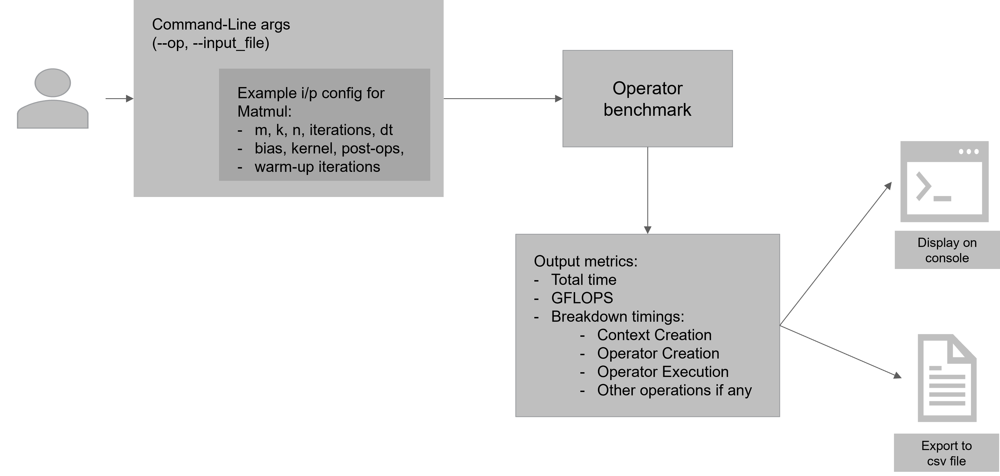
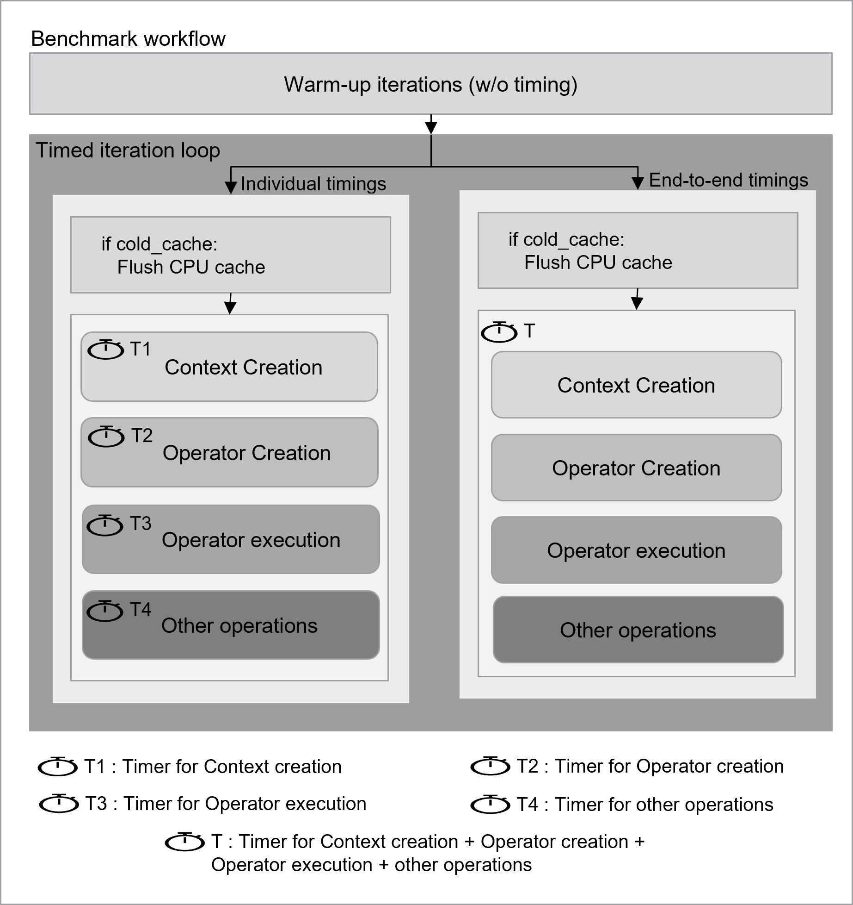

(Copyright (c) 2025-2026 Advanced Micro Devices, Inc. All rights reserved.)

# Overview
`benchdnn` is a high-performance benchmarking utility purpose-built to rigorously assess the `efficiency` of Matmul, Reorder, Embedding Bag, Normalization, Group MatMul, and Scaled Dot-Product Attention (SDPA) operators within the `ZenDNN (Zen Deep Neural Network)` library. It plays a pivotal role in the ZenDNN ecosystem by enabling detailed performance analysis of deep learning primitives.

# Purpose and Audience
This tool is indispensable for a wide range of users, including `developers`, `researchers`, and `performance engineers`. Whether you're optimizing kernel implementations, experimenting with new data types, or evaluating the impact of various optimization strategies, `benchdnn` provides the precision and flexibility needed to make informed decisions.

# Flexible Configuration
Designed with adaptability in mind, `benchdnn` supports a broad spectrum of configurable parameters. Users can specify matrix dimensions, data types, post-operations (such as activation functions or element-wise operations), and kernel backends. These configurations can be supplied either through intuitive command-line arguments or structured input files, making the tool suitable for both quick tests and large-scale automated benchmarking.

# Extensibility for Innovation
One of the core strengths of `benchdnn` is its extensible architecture. New operators, data types, and post-processing functions can be seamlessly integrated into the framework. This makes it an ideal platform for ongoing development, experimentation, and validation of emerging features within ZenDNN.

# Precision in Performance Measurement
Accuracy is at the heart of `benchdnn`'s design. To ensure that performance metrics reflect real-world behavior, the tool incorporates several advanced features:
- Warmup iterations to eliminate cold-start anomalies.
- Runtime cache behavior via `--cache_mode` (cold, warm for matmul, or hot) to match the scenario under test.
- Detailed timing breakdowns, including:
  - Context creation
  - Operator setup
  - Execution time

These capabilities help isolate performance bottlenecks and provide a reliable foundation for performance tuning and regression analysis

## Supported Features Overview

| Feature              | Supported Values                        |
|----------------------|----------------------------------------|
| Operators            | matmul, reorder, embag, normalization, grp_matmul, sdpa |
| Multi-layer Matmul   | Supported                               |
| Data Types           | Floating-point: `f32`, `bf16` (all ops), and `f16` (SDPA only, requires AVX512-FP16). Integer / quantized: `s8`, `u8`, `s4` on the matmul / reorder / embag paths. See each operator's doc for the exact per-op support matrix. |
| Timing Modes         | end-to-end, detailed timing breakdowns  |
| Cache Modes          | `hot`, `cold`; matmul also `warm` (`--cache_mode`, default `hot`) |
| Warmup Iterations    | Supported (configurable)                |
| Batched Matmul (BMM) | Supported (via 'bs' field and --ndims=3)         |

## Flow Diagram

Below is a high-level flow diagram illustrating the benchmarking process:



### Benchmark Workflow Diagram

#### Cache mode (runtime)
Cache behavior is selected at run time with `--cache_mode=<value>`. Values are case-insensitive; default is `hot`.

- **`hot`**: No extra cache flushing between timed iterations (fastest, warm-cache style measurements).
- **`cold`**: Flush caches before each timed iteration where the operator path supports it (cold-cache style).
- **`warm`** (matmul only): Intermediate behavior; see [matmul](doc/matmul.md) for details.

Matmul supports `cold`, `warm`, and `hot`. All other operators (reorder, embag, normalization, grp_matmul, sdpa) support `cold` and `hot`; passing `--cache_mode=warm` with any non-matmul `--op` is rejected by `main()`. Operator-specific examples are in the linked operator documentation.

#### Timing Mode Selection
The timing mode is controlled by the macro `MEASURE_INDIVIDUAL_TIMINGS` defined in `benchdnn.hpp`:

- If `MEASURE_INDIVIDUAL_TIMINGS` is set to `1`, individual timings for each operation (context creation, operator creation, operator execution, other operations) are recorded.
- If `MEASURE_INDIVIDUAL_TIMINGS` is set to `0`, only end-to-end timings are recorded.

Set this macro according to your benchmarking needs before building the project.

Below is a workflow diagram showing the main steps in the benchmarking process:




#### Benchmark Workflow Overview

The flow is split into two main sections:

**1. Individual Timings**
  - Each operation is timed separately using distinct timers:
    - T1: Context Creation
    - T2: Operator Creation
    - T3: Operator Execution
    - T4: Other Operations
  - If `--cache_mode=cold` is set, the CPU cache is flushed before each timed operation where supported.

**2. End-to-End Timings**
  - All operations are timed together using a single timer:
    - T: Measures the total time for Context Creation + Operator Creation + Operator Execution + Other Operations.
  - Cache flushing also occurs here if `--cache_mode=cold` is set.


## Features
- **Operator Selection via Command-Line**: Use `--op=<operator>` to specify the operation to benchmark (e.g., `--op=matmul`, `--op=reorder`, `--op=embag`, `--op=normalization`, `--op=grp_matmul`, `--op=sdpa`).
- **Flexible Input File**: Use `--input_file=<filename>` to provide a configuration file tailored to the selected operator.
- **Matmul Benchmarking**: Supports matrix multiplication benchmarks with options for single-layer, multi-layer, and batched matmul.
- **Reorder Benchmarking**: Supports tensor reorder benchmarks with configurable parameters.
- **Embag Benchmarking**: Supports embedding bag benchmarks with configurable parameters.
- **Normalization Benchmarking**: Supports layer_norm, batch_norm, rms_norm, and fused_add_rms_norm benchmarks via the LOWOHA API with configurable shapes, data types, thread counts, and in-place operation (enabled by default).
- **SDPA Benchmarking**: Supports Scaled Dot-Product Attention (Flash Attention CPU backend) via the LOWOHA `sdpa_direct` API. Covers self-attention and cross-attention, causal and additive (2D / 4D) masks, `f32`, `bf16` and `f16` Q/K/V (the `f16` path requires AVX512-FP16), and the matching set of mask dtypes (`f32` for `f32`; `f32`/`bf16` for `bf16`; `f32`/`f16` for `f16`).
- **Multiple Data Types**: Floating-point `f32` and `bf16` across all operators, `f16` for SDPA (requires AVX512-FP16), plus integer / quantized paths (`s8`, `u8`, `s4`) on matmul, reorder, and embag. Per-operator support matrices are documented in the linked operator docs (e.g. matmul's `(src, wei, dst)` triplets and SDPA's `(qkv_dt, mask_ndims, mask_dt)` table).
- **Detailed Timing**: Reports total time, GFLOPS, and detailed timing statistics (context creation, operator creation, execution), including percentage breakdowns for each stage (% of total time)
- **Warmup Iterations**: Optional warmup runs to stabilize measurements
- **Cache control**: `--cache_mode` selects hot, cold, or (matmul) warm behavior at run time
- **LOWOHA vs regular API**: `--lowoha=true|false` (or `1`/`0`); default is `true` for matmul, reorder, and embag (see operator docs for input format differences)
- **Comprehensive Output**: Results are printed to the console and saved to a timestamped CSV file for easy analysis


## Build Instructions

From the ZenDNN root directory:

```sh
mkdir build && cd build
cmake .. -DZENDNNL_BUILD_BENCHDNN=ON
cmake --build .
```

## Running the Benchmark

To run a benchmark, specify the operator and input method as command-line arguments from the build directory. For example:

```sh
./install/benchdnn/bin/benchdnn --op=<operator> [--input_file=<file>] [command-line options] [--input_model_file=<model_file>] [--lowoha=true|false] [--cache_mode=cold|warm|hot]
```

- `<operator>`: Operator can be one of the following :
  - [matmul](doc/matmul.md)
  - [reorder](doc/reorder.md)
  - [embag](doc/embag.md)
  - [normalization](doc/normalization.md)
  - [grp_matmul](doc/grp_matmul.md)
  - [sdpa](doc/sdpa.md)
- `--input_file=<file>`: Path to a configuration file with one or more test cases.
- `--input_model_file=<model_file>`: (Optional) Path to a model file for model-based benchmarking.
- `[command-line options]`: Command-line arguments to specify all required parameters directly. These can be used in combination with model files.
- `--lowoha`: Select Low Overhead API paths where applicable (`true`/`false` or `1`/`0`; default `true`). See the operator doc for input file layout when toggling.
- `--cache_mode`: `cold`, `hot`, or (matmul only) `warm`; default `hot`.

The output CSV files (`timings_<timestamp>.csv`) are located in the `build` directory.

## Extending
- Add new post-operations or data types by updating enums and parsing logic in the utility and parser modules.
- Follow Doxygen-style documentation and project code style for contributions.

## Documentation & Diagrams
- All major source/header files and functions are documented with Doxygen-style comments.
- See the `benchdnn` directory for high-level and data flow diagrams (if provided).

## License

Licensed under the Apache License, Version 2.0. See the ZenDNN root directory for details.
