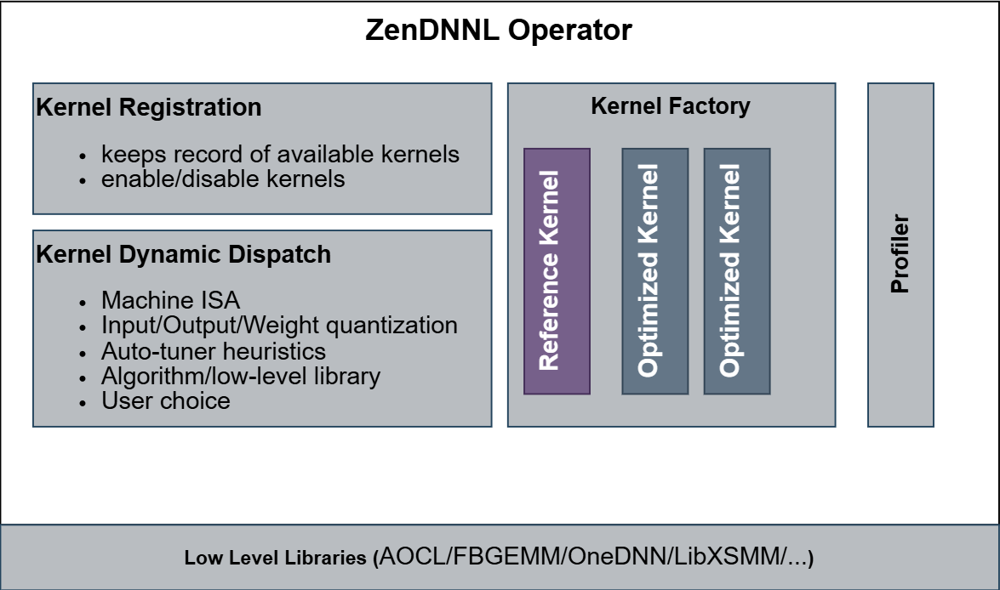
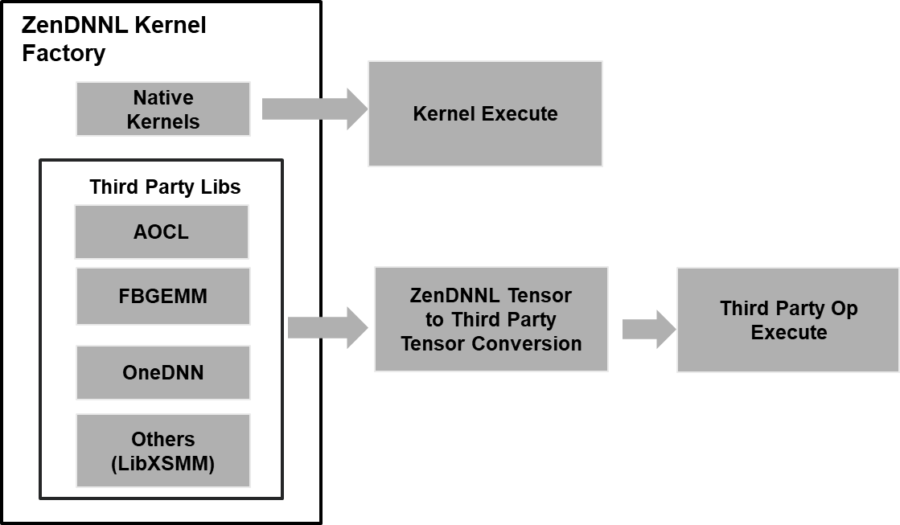

# ZenDNN* Operator

The **ZenDNN* Operator** is a central architectural component in the ZenDNN* framework, designed to manage the lifecycle and execution of computational kernels. It plays a pivotal role in ensuring that deep learning operators are executed with maximum efficiency, adaptability, and hardware awareness.

## 1. Kernel Registration 

The **Kernel Registration** module is responsible for maintaining a comprehensive registry of all available kernels—both **reference** and **optimized**. It serves as the metadata hub for kernel capabilities and availability.

- **Kernel Inventory Management**: The system keeps a detailed record of all kernels, including their supported data types, quantization formats, and hardware compatibility.
- **Enable/Disable Mechanism**: Developers and system integrators can selectively enable or disable kernels based on deployment constraints, debugging needs, or performance considerations.
- **Extensibility**: New kernels can be registered dynamically, allowing the framework to evolve and support emerging hardware or algorithmic innovations.

## 2. Kernel Dynamic Dispatch

The **Dynamic Dispatch Engine** is the decision-making core of the factory. It intelligently selects the most appropriate kernel for a given operator execution based on a rich set of runtime parameters and heuristics.

- **Machine ISA Awareness**: The dispatcher evaluates the underlying CPU's instruction set architecture (ISA)—such as AVX2, AVX512, or SSE—and selects kernels optimized for those instructions.
- **Quantization Compatibility**: It ensures that the selected kernel supports the quantization format of the input, output, and weight tensors (e.g., int8, bf16, float32).
- **Auto-Tuning and Profiling**: Leveraging historical performance data and runtime profiling, the dispatcher uses heuristics to choose the fastest kernel for the current workload.
- **Algorithm and Library Selection**: The dispatcher can choose between different algorithmic strategies or delegate execution to specialized low-level libraries.
- **User Preferences**: Advanced users can override default behavior by specifying preferred kernels or dispatch policies.

## 3. Kernels

Kernels are the **execution engines** of the ZenDNN* framework. They implement the actual computations defined by operators and are optimized for specific hardware and problem sizes.

- **Reference Kernels**: These are baseline implementations that prioritize correctness and portability. They serve as fallbacks when optimized kernels are unavailable or unsuitable.
- **Optimized Kernels**: These are high-performance implementations tailored for specific ISAs and quantization schemes. They leverage advanced CPU features to maximize throughput and minimize latency.

Each kernel is designed to be modular and reusable, supporting a wide range of operators such as matrix multiplication, convolution, and embedding bag operations.

## 4. Profiler

The **Profiler** is an integral component that monitors kernel performance during runtime. It collects metrics such as execution time, memory usage, and cache efficiency.

- **Performance Feedback Loop**: The profiler feeds data back into the dynamic dispatch engine, enabling it to make smarter decisions over time.
- **Auto-Tuning Support**: By analyzing performance trends, the profiler helps identify the best-performing kernels for specific workloads and hardware configurations.

## 5. Low-Level Libraries

At the foundation of the kernel factory are **low-level computational libraries** that provide highly optimized routines for matrix operations and other primitives.

- **AOCL (AMD Optimized CPU Libraries)**: Offers high-performance math routines for AMD CPUs.
- **FBGEMM (Facebook GEMM)**: Specializes in quantized matrix multiplication, widely used in inference workloads. **Coming Soon**
- **OneDNN** – oneAPI Deep Neural Network Library provides highly optimized building blocks for deep learning applications. **Coming Soon**
- **LibXSMM**: Optimized for small matrix multiplications, often used in deep learning and HPC applications. **Coming Soon**

These libraries are abstracted by the kernel factory, allowing ZenDNN* to remain hardware-agnostic while still benefiting from platform-specific optimizations.

# End-to-End Workflow

1. **Input Tensor Creation**: Raw data is encapsulated in tensors, including metadata like shape, stride, and quantization parameters.
2. **Context Initialization**: Operator-specific parameters such as weights, biases, and post-ops are bundled into a context object.
3. **Operator Execution**: The operator invokes the kernel factory to select and execute the most suitable kernel.
4. **Kernel Invocation**: The selected kernel performs the computation, leveraging ISA-specific instructions and quantization-aware logic.
5. **Output Tensor Generation**: Results are stored in output tensors, ready for the next stage in the computation graph.

## Integration Workflow: ZenDNN* Kernel Factory and Third-Party Execution

The **ZenDNN* Kernel Factory** is architected to not only manage its own suite of native, highly optimized kernels but also to **seamlessly interface with third-party libraries**. This hybrid design empowers ZenDNN* to combine the benefits of in-house performance tuning with the robustness and maturity of external computational libraries. The result is a flexible, extensible, and high-performance inference engine that adapts to diverse hardware and software environments.

### Key Components in the Execution Flow

#### 1. ZenDNN* Kernel Factory
This is the **central orchestration unit** responsible for managing kernel selection and dispatch. It evaluates the operator requirements, hardware capabilities, and quantization settings to determine the most suitable execution path.

- **Native Kernels**: These are handcrafted, performance-tuned kernels developed specifically for ZenDNN*. They are optimized for various CPU architectures and support advanced features like fused operations and quantization-aware execution.
- **Third-Party Libraries**: When native kernels are unavailable or suboptimal for a given configuration, ZenDNN* can delegate execution to trusted external libraries, including:
  - **AOCL** – AMD Optimized CPU Libraries for high-performance math routines.
  - **FBGEMM** – Facebook’s library for quantized matrix operations, ideal for inference. **Coming Soon:**
  - **OneDNN** – oneAPI Deep Neural Network Library provides highly optimized building blocks for deep learning applications. **Coming Soon:**
  - **LibXSMM** – Specialized in small matrix multiplications, often used in HPC and ML workloads. **Coming Soon:**
  

#### 2. Tensor Conversion Layer
Labeled in the diagram as **"ZenDNN* Tensor to Third Party Tensor"**, this layer acts as a **compatibility bridge** between ZenDNNL’s internal tensor representation and the expected input format of third-party libraries.

- **Responsibilities**:
  - **Data Layout Transformation**: Converts tensors from ZenDNNL’s memory layout (e.g., NCHW, NHWC) to the format required by the target library.
  - **Quantization Metadata Mapping**: Ensures that scale factors, zero points, and data types are correctly translated.
  - **Memory Alignment and Buffer Management**: Allocates and aligns memory buffers to meet the performance and correctness requirements of the third-party backend.

This layer ensures **data integrity and performance continuity** across different execution environments.

#### 3. Third-Party Operator Execution
Once the tensor is transformed, the **actual computation is offloaded** to the selected third-party kernel. This process is **fully abstracted** from the user, maintaining a consistent API and operator interface.

- The execution is optimized based on:
  - Instruction Set Architecture (ISA)
  - Quantization level (e.g., int8, bf16)
  - Operator type and tensor shape

ZenDNN* handles the **dispatch, execution, and result retrieval**, ensuring that the output tensor is compatible with the rest of the inference pipeline.

### Practical Use Case: Fully Connected Layer Execution

Consider a scenario where a fully connected (dense) layer is being executed during inference:

1. The **ZenDNN* Kernel Factory** evaluates the operator and determines that the input tensor is quantized (int8) and the target CPU supports AVX512.
2. It identifies **AOCL** as the optimal backend for this configuration due to its efficient int8 GEMM routines.
3. The input tensor is passed through the **conversion layer**, which adapts its layout and quantization metadata to match AOCL's expectations.
4. The **AOCL kernel** is invoked to perform the matrix multiplication.
5. The result is converted back into a ZenDNN*-compatible tensor and passed to the next operator in the graph.

##### note: Limited functionality available.

>ZenDNN* : ZenDNN is currently undergoing a strategic re-architecture and refactoring to enhance performance, maintainability, and scalability.
