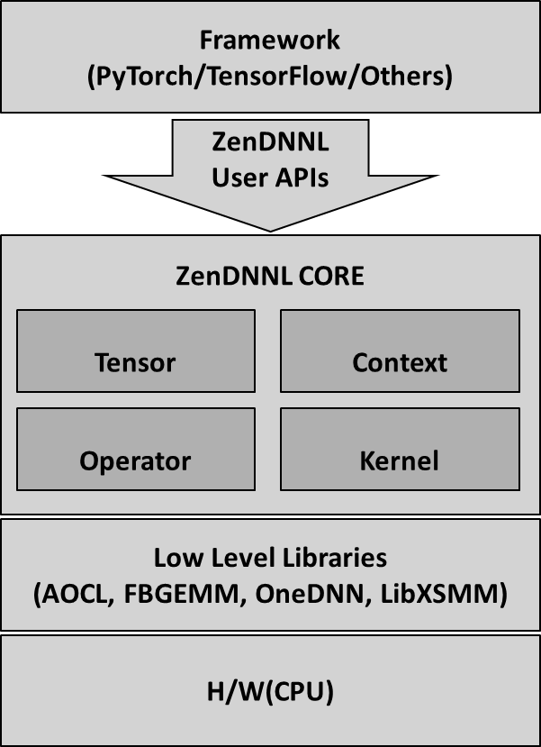

(Copyright (c) 2025 Advanced Micro Devices, Inc. All rights reserved.)

# ZenDNN* Architecture

## Overview
ZenDNN* is a high-performance CPU inference library designed to accelerate deep learning workloads. It provides optimized implementations for several key operations. The architecture is modular, extensible, and integrates seamlessly with popular deep learning frameworks. Its layered architecture ensures flexibility, extensibility, and high performance across a variety of hardware platforms and use cases.





## 1. Framework Layer
This is where model developers define their neural networks using high-level APIs provided by frameworks like PyTorch, TensorFlow, or ONNX. These frameworks handle model construction, training, and inference logic. When a model is executed, the framework translates operations into a format that ZenDNN* can understand.

## 2. ZenDNN* User APIs
The **ZenDNN* User API layer** is a critical interface that connects high-level deep learning frameworks (like PyTorch or TensorFlow) with the optimized computational backend of ZenDNN*. The User API layer is designed to be **lightweight, extensible, and framework-agnostic**. It ensures that ZenDNN* can be easily integrated into various ecosystems without requiring deep changes in the framework internals. It also enables rapid experimentation and deployment of new operators and optimizations.

### Features

#### 2.1. Tensor Creation and Management
- Accepts input and output buffers from the framework.
- Wraps them into ZenDNN*-compatible tensor objects.
- Handles metadata such as shape, data type (FP32, BF16, INT8), and memory layout (blocked and non blocked).
- Ensures zero-copy or minimal-copy data handling to reduce overhead.

#### 2.2. Operator Registration and Dispatch
- Maintains a registry of supported operators (Example: MatMul, Fused MatMul, Reorder, etc.).
- Maps framework-level operations to ZenDNN* core implementations.
- Combines multiple operations into a single kernel to reduce memory bandwidth and improve cache locality.

#### 2.3. Precision Control
- Allows frameworks to specify the desired precision for inference:
  - **FP32**: Full precision for accuracy-sensitive tasks.
  - **BF16**: Balanced precision for performance and accuracy.

#### 2.4. Execution Context Management
- Initializes and manages execution contexts (Example: constant buffers, post ops, etc. )
- Provides hooks for profiling and logging.


## 3. ZenDNN* Core
The core is the computational heart of ZenDNN*. It includes:
- **Tensor**: Manages data layout, memory, and shape transformations.
- **Context**: Maintains constant model parameters, post op operation, runtime settings like threading and logging and profiling information.
- **Operator**: Defines high-level operations like MatMul, Reorder, etc.
- **Kernel**: Implements low-level, hardware-optimized routines for each operator.


## 3.1 Tensor
A **Tensor** is a fundamental building block in deep learning libraries. It represents multi-dimensional arrays of data. In the context of CPU inference, tensors are used to store and manipulate data efficiently.

### Key Components of a Tensor:
1. **Tensor Metadata**:
   - **Dimensions**: Specifies the shape of the tensor (Example: 2x3 matrix).
   - **Sizes**: Indicates the size of each dimension.
   - **Stride**: Defines the step size to move from one element to the next in memory.
   - **Data Type**: Specifies the type of data stored (Example: float32, int8).

2. **Tensor Quantization Data**:
   - **Scale**: A factor used to map the tensor values to a quantized range.
   - **Zero Point**: An offset used in quantization to map zero in the original data to a quantized value.

3. **Memory Buffer**:
   - A contiguous block of memory allocated to store the tensor data.

### Use Cases:
- **Input Data**: Tensors are used to represent input data fed into the neural network.
- **Intermediate Results**: During computation, tensors store intermediate results.
- **Output Data**: The final output of the neural network is stored in tensors.

## 3.2 Context
The **Context** of an operator encompasses all the necessary information required to perform computations. Given an operator its parameter tensors (for example: weight and bias), and any other parameter (for example: element-wise post-ops, or embedding bag algorithm like add, mean, or max), needed to implement operator computation are called operator context of the operator.

### Key Components of Context:
1. **Parameter Tensors**:
   - **Weight**: Represents the learned weights of the neural network.
   - **Bias**: Represents the bias values added to the weighted sum.

2. **Additional Parameters**:
   - **Element-wise Post-ops**: Operations applied element-wise after the main computation (Example: activation functions).
   - **Embedding Bag Algorithm**: Algorithms like add, mean, or max used in embedding layers.

### Use Cases:
- **Operator Computation**: Context provides all the necessary data for an operator to perform its computation.
- **Optimization**: Context helps in optimizing the computation by providing relevant parameters.

## 3.3 Operator
An **Operator** is a function or a set of functions that perform computations on tensors. An operator in a computational graph is a node that takes input tensors, performs some computations on them, and produces output tensors. An operator can implement a simple computation on input tensors (add, concat...), computations involving other tensors acting as operator parameters (matrix multiplication with weight and bias as operator parameters), or a complex subgraph (attention layer in LLMs).

### Key Components of an Operator:
1. **Simple Computations**:
   - **Matrix Multiplication**: Performs multiplication of input tensors with weight and bias as parameters.
   - **Element-wise Operations**: Applies operations like activations, addition, subtraction, etc., on tensors.

2. **Complex Subgraphs**:
   - **Attention Layer**: Implements attention mechanisms used in large language models (LLMs).

### 3.4 Operator Type

#### 3.4.1 Fused MatMul
Fused Matrix Multiplication (Fused MatMul) is an optimized operation that combines multiple matrix multiplications and element-wise operations into a single kernel. This reduces memory bandwidth requirements and improves computational efficiency.

##### Key Components:
1. **Matrix Multiplication**: Performs the multiplication of input tensors.
2. **Element-wise Operations**: Applies operations like activations, addition, subtraction, etc., in a fused manner.

##### Use Cases:
- **Neural Network Layers**: Commonly used in fully connected layers and transformer models.
- **Performance Optimization**: Reduces the number of memory accesses and improves cache utilization.

#### 3.4.2 Reorder
Reorder operation changes the memory layout of a tensor to improve data locality and access patterns. This is crucial for optimizing performance on different hardware architectures.

##### Key Components:
1. **Memory Layout Transformation**: Changes the order of data storage in memory.
2. **Data Locality**: Improves access patterns for subsequent operations.

##### Use Cases:
- **Data Preprocessing**: Reorders data to match the expected input format of specific kernels.
- **Performance Optimization**: Enhances cache utilization and reduces memory access latency.

#### 3.4.3 Embedding Bag
Embedding Bag operation is used to look up embeddings for a set of indices and combine them using a specified reduction algorithm (Example: sum, mean, max).

##### Key Components:
1. **Embedding Lookup**: Retrieves embeddings for given indices.
2. **Reduction Algorithm**: Combines the retrieved embeddings using a specified method.

##### Use Cases:
- **Natural Language Processing**: Commonly used in models for handling categorical data, such as word embeddings.
- **Recommendation Systems**: Utilized for representing user and item features.

## 3.5 Kernel
A **Kernel** is an implementation of an operator. Kernels ensure efficient execution of operators on different architectures. An operator can have multiple kernels depending on machine ISA, problem size, backend and quantization level.

### Key Components of a Kernel:
1. **Machine ISA**:
   - **Instruction Set Architecture**: Kernels are optimized for specific ISAs (Example: AVX, SSE).

2. **Problem Size**:
   - **Small vs. Large**: Kernels are tailored to handle different problem sizes efficiently.

3. **Backend and Quantization Level**:
   - **Backend**: Specifies the computational backend (Example: CPU, GPU).
   - **Quantization Level**: Indicates the level of quantization applied to the data.

### Use Cases
- **Performance Optimization**: Kernels ensure that operators run efficiently on the target hardware.
- **Scalability**: Kernels allow operators to scale across different problem sizes and hardware configurations.

## Interaction Between Main Classes

Understanding how **Tensor**, **Context**, **Operator**, and **Kernel** interact is essential for designing efficient and modular deep learning systems.

### Data Flow Overview

1. **Input Tensor Creation**:
   - The inference process begins with the creation of input tensors that hold the raw data (Example: images, text embeddings).

2. **Context Initialization**:
   - A context is initialized with parameters such as weights, biases, and configuration settings (Example: activation functions, quantization details).

3. **Operator Execution**:
   - The operator receives the input tensor and context. It validates the inputs and selects the appropriate kernel based on the data type, hardware, and problem size.

4. **Kernel Invocation**:
   - The selected kernel performs the actual computation, leveraging hardware-specific optimizations (Example: AVX512 instructions on Intel CPUs).

5. **Output Tensor Generation**:
   - The result of the kernel execution is stored in an output tensor, which can be passed to the next operator in the computation graph.


## 4. Low-Level Libraries
ZenDNN* leverages several low-level libraries to provide foundational building blocks for performance-critical operations:
- **AOCL (AMD Optimized CPU Libraries)**: Optimized BLAS, FFT, and RNG for AMD CPUs.
- **FBGEMM**: Efficient low-precision (INT8, BF16) matrix multiplication.
- **OneDNN**: Intel’s deep learning primitives for x86 CPUs.
- **LibXSMM**: Specialized in small matrix multiplications (Example: 64x64 or smaller).

## 5. Hardware Layer
ZenDNN* is engineered to extract maximum performance from **general-purpose CPUs**, making it ideal for server-side inference, edge computing, and CPU-only environments. This layer is where all computations are ultimately executed, and its efficiency directly impacts the overall throughput and latency of deep learning models.

### Key Optimization Strategies

#### 5.1 Instruction Set Utilization
ZenDNN* is optimized to leverage modern CPU instruction sets that enable vectorized and parallel computation:
- **AVX2 (Advanced Vector Extensions 2):** Widely supported on modern x86 CPUs, enables 256-bit SIMD operations.
- **AVX-512:** Offers 512-bit SIMD operations, allowing more data to be processed per instruction cycle. Ideal for FP32 and BF16 workloads.

These instruction sets are detected at runtime, and ZenDNN* dynamically selects the best kernel path based on the available hardware.

#### 5.2 Multi-threading
ZenDNN* supports parallel execution using:
- **OpenMP:** A widely-used API for multi-threaded programming in C/C++.

This allows ZenDNN* to scale across multiple CPU cores, improving throughput for batch inference and large models.

#### 5.3 Cache Optimization
ZenDNN* kernels are designed to:
- Maximize data reuse within L1/L2/L3 caches.
- Use blocking and tiling strategies to reduce cache misses.
- Align memory access patterns with CPU prefetching behavior.


## Execution Flow
Here's a simplified flow of how a tensor moves through the ZenDNN* stack:

1. **Input Tensor** is passed from the framework (Example: PyTorch).
2. The **User API** receives the tensor and determines the appropriate operator.
3. The **Core** processes the tensor using the selected operator and kernel.
4. The **Kernel** invokes routines from **Low-Level Libraries** (Example: AOCL, OneDNN).
5. Computation is executed on the **CPU**.
6. The **Output Tensor** is returned back to the framework.

```
Input Tensor (from Framework)
          ↓
   ZenDNN* User API
(Receives tensor, create context and operator)
          ↓
      ZenDNN* Core
(Processes tensor using operator & kernel)
          ↓
   Low-Level Libraries
(Invokes optimized routines: AOCL, OneDNN, etc.)
          ↓
         CPU
(Performs computation)
          ↓
     Output Tensor
(Returned to Framework)
```


## Design Principles

#### 1. Modularity
- Each class is designed to be independent and reusable.
- Operators can be swapped or extended without modifying the core tensor or context logic.

#### 2. Hardware Abstraction
- Kernels abstract away hardware-specific details, allowing operators to remain platform-agnostic.

#### 3. Extensibility
- New operators and kernels can be added with minimal changes to the existing framework, supporting rapid prototyping and deployment.

#### 4. Performance Optimization
- Leverages the best available kernel for each scenario.

#### 5. User Transparency
- The complexity of backend selection and tensor conversion is hidden from the user, ensuring a clean and consistent interface.

>ZenDNN* : ZenDNN is currently undergoing a strategic re-architecture and refactoring to enhance performance, maintainability, and scalability.
