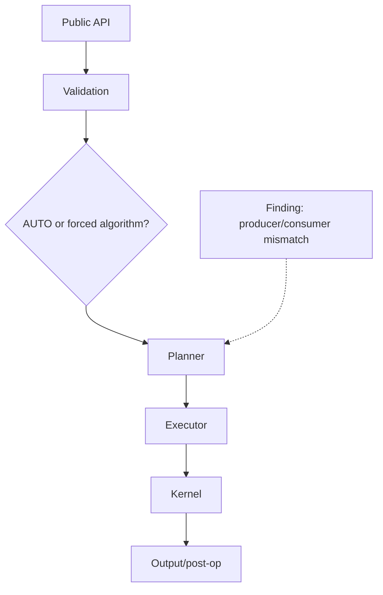
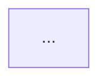

# ZenDNN Pull Request Review

Use this skill when the user says:

```text
Use @skills/ZenDNN/skills/pr_review/zendnn-pr-review-skill.md on <PR_URL>
```

The requested deliverable is a completed GitHub review, not merely a local
summary. Unless the user narrows the task, inspect the code, run proportionate
validation, post actionable inline comments, and submit the appropriate review
decision.

GitHub CI status and logs are out of scope. Do not inspect failed or pending
checks, wait for workflows, or use CI results as review evidence. Base the
review decision on the code, prior review discussion, and locally gathered
validation.

Local validation is enabled by default and is opt-out by category. When the
user explicitly excludes a validation activity, skip exactly that activity and
continue every other applicable review and validation step. Do not broaden one
exclusion into related categories. For example:

```text
Use @skills/ZenDNN/skills/pr_review/zendnn-pr-review-skill.md on <PR_URL>.
Don't do BenchDNN and regression tests.
```

This skips BenchDNN and regression-test execution only. It does not skip code
review, test-quality inspection, builds, GTest/accuracy tests, sanitizers, or
other applicable validation unless the user excludes those too.

## Core user requirements (verbatim)

> Do thorough code review. make sure all the functionalities are working. there should not be any memory leak, unused variables, any unwanted overhead of code, documentation if it is inlined with code, etc you can check.
>
> Make sure you add comments only if it require some change, don't comment just randomly.
>
> In the review description, If you see any design level change or some support is introduced in the flow, generate full diagram/flowchart of that part or area around it. every change should be visible diagrammatically.
>
> Lets say if the change is in 2 different part of codes then generate 2 diagrams to show how they fit in the current code flow
>
> You need to check as well if the PR is already reviewed before and diagram is already added then add new only if required. also dont add repeated comment if someone has already pointed out.

## Non-negotiable rules

1. Review the current remote PR head, not a stale local branch.
2. Review the complete PR diff from its merge base, not only the latest commit.
3. Do not modify, commit, push, merge, or force-update the PR branch.
4. Work in an isolated detached worktree so the user's branch, build, and
   running tests remain untouched.
5. Read all existing review comments, replies, issue comments, review bodies,
   and resolution states before posting.
6. Do not duplicate an existing finding. Reply to the existing thread if new
   evidence materially improves it.
7. Post an inline comment only when a code, test, documentation, or design
   change is required.
8. Do not post praise, stylistic preferences, speculative concerns without a
   reachable scenario, or comments whose only purpose is to show activity.
9. Never claim all functionality works merely because the build or current
   tests pass. State exactly what was and was not validated.
10. Do not finalize while any delegated reviewer, build, test, or requested
    validation is still running.
11. Re-check the remote head immediately before posting. If it changed, review
    the new delta first.
12. Do not inspect GitHub CI check status, workflow results, annotations, or
    logs.
13. Honor explicit user validation exclusions. Do not run an excluded activity,
    do not silently substitute a similar activity, and do not mark it passed.
14. Use `gh` for every GitHub read/write operation.

## Review ledger

Maintain an internal ledger throughout the review:

```text
PR head reviewed: <sha>
Base / merge base / risk tier: <branch> / <sha> / <0-3 + rationale>
User-requested validation exclusions: <none | exact excluded activities>
Changed areas:
- [ ] Routing / public behavior
- [ ] Planner / scheduler
- [ ] Numerical kernels
- [ ] Quantization / dtype / layouts
- [ ] Memory ownership / lifetime
- [ ] Tests / benchmarks
- [ ] Documentation / telemetry

Parallel reviewers:
- [ ] <area>
- [ ] <area>

Validation (excluding only user-named activities):
- [ ] Diff integrity
- [ ] Build
- [ ] Targeted tests
- [ ] Sanitizer or memory test when applicable
- [ ] Performance evidence when defaults or hot paths change

GitHub:
- [ ] Existing comments deduplicated
- [ ] Required inline comments posted
- [ ] Diagrams checked or added
- [ ] Review decision submitted
```

The task is incomplete while any checked area or reviewer is still pending.

## Phase 1: Establish the review target

1. Parse and validate the PR URL. Confirm it belongs to the intended ZenDNN
   repository.
2. Record any explicitly excluded validation activities, then inspect running
   terminal processes before starting non-excluded builds or tests. Do not
   duplicate or interrupt the user's work.
3. Fetch with `gh pr view`:
   - title, body, author, state, draft state
   - base and head branches
   - commits and changed files
   - additions/deletions
   - current reviews and review decision
4. Resolve the current head SHA independently with the remote PR ref.
5. Fetch the base and PR refs without checking out over the user's branch.
6. Create a uniquely named detached review worktree.
7. Record:
   - current PR head SHA
   - merge-base SHA
   - previous reviewed SHA, if this is a rereview
8. Run `git diff --check` and inspect the full diff/stat.

If the PR head changes during the review, fetch it and review
`old_reviewed_sha..new_head` before commenting.

## Phase 2: Inspect prior review history before code

Fetch all pages of:

- inline pull-request review comments
- review replies
- review bodies
- issue/conversation comments
- review-thread resolution and outdated state

Build a finding map keyed by:

```text
<path> + <logical defect> + <trigger/impact>
```

For every prospective finding, classify it:

- **Already reported and still accurate**: do not add another thread.
- **Already reported but missing decisive evidence**: reply with only the new
  reproduction, measurement, or proof.
- **Reported and fixed**: verify code and tests; do not repeat it.
- **Marked resolved but not fixed**: verify carefully, reply if useful, and
  reopen the thread when the defect remains.
- **Obsolete after force-push**: do not revive it unless the defect remains in
  current code.
- **New finding**: eligible for an inline comment.

Inspect existing Mermaid diagrams. Reuse them when still accurate. Add or
replace a diagram only when the current design is missing, materially changed,
or incorrectly represented.

## Phase 3: Understand the entire change

Read the PR commit series and group changed files by execution flow, not merely
by directory. Typical independent ZenDNN areas include:

- API validation and AUTO routing
- M-tile or N-tile planning
- OpenMP execution and topology mapping
- custom microkernel dispatch and packing
- quantization/reorder metadata
- fused MoE Op1/activation/Op2 lifetime
- tests, BenchDNN, telemetry, and public documentation

Trace each changed behavior from public entry point to final backend:

```text
API input
  -> validation
  -> algorithm selection
  -> planner
  -> executor / thread mapping
  -> kernel / fallback
  -> post-op / output
  -> telemetry
```

Do not treat tests or comments as proof that code follows the claimed flow.

## Phase 4: Parallel deep review

For a non-trivial PR, delegate independent areas in parallel. Useful partitions:

1. Routing, API contracts, environment precedence, telemetry, and docs
2. Planner arithmetic, topology, bounds, and scheduling
3. Numerical kernels, packing, pointers, strides, and memory safety
4. M-tile/OpenMP concurrency, pools, atomics, and fallback behavior
5. Tests, benchmarks, lifetime, and sanitizer applicability

Give each reviewer:

- repository/worktree path
- base and current head SHAs
- exact focus area
- instruction not to edit or post comments
- requirement for current file/line, reachable scenario, impact, and evidence
- requirement to distinguish confirmed defects from unverified risks

Wait for every reviewer. Reconcile duplicates and independently validate
high-severity claims before posting.

## Phase 5: Apply the detailed ZenDNN checklist

Before reviewing code, read
[zendnn-pr-review-reference.md](zendnn-pr-review-reference.md). Apply every
relevant item across functionality, numerics, memory, concurrency, planner
math, performance, tests, code quality, and documentation. Record any item
that cannot be validated rather than silently treating it as passed.

## Phase 6: Validation strategy

Read the risk-tier, functionality-matrix, and BenchDNN sections in
[zendnn-pr-review-reference.md](zendnn-pr-review-reference.md), then classify
the PR before running expensive work:

Validation is enabled by default. Apply the risk tier to every activity except
those the user explicitly excluded. Match exclusions narrowly:

- `Don't run BenchDNN` skips BenchDNN, not GTest, accuracy, or builds.
- `Don't run regression tests` skips regression-test execution, not static
  inspection of the changed tests or other functional suites.
- `Don't run performance tests` skips performance benchmark execution,
  including BenchDNN when it is being used as a performance benchmark.
- `Don't run GTest/accuracy tests` skips those suites only.

Record each excluded activity as `skipped by user request`, including what it
would have validated. Continue all non-excluded validation.

- **Tier 0**: non-behavioral docs/comments/formatting — focused inspection and
  applicable static checks; normally no build or benchmark.
- **Tier 1**: localized low-risk bug fix — affected build, regression test,
  nearby suite, and fallback/negative case; benchmark only if hot-path relevant.
- **Tier 2**: moderate feature/flow change — Release build, functional matrix,
  affected suites, applicable sanitizer/concurrency tests, and baseline-vs-PR
  BenchDNN when runtime cost can change.
- **Tier 3**: default, kernel, scheduler, quantization, fusion, cache, lifetime,
  or broad API change — equivalent merge-base/head builds, execution-level
  oracles, affected regression suites, applicable sanitizers, default and
  escape-hatch paths, repeated BenchDNN, and model/profile runs when relevant.

Risk comes from changed behavior, not PR size. Escalate a small diff that
changes a default or hot loop; do not run broad expensive validation for a
minor non-behavioral edit.

For every new capability, run the following non-excluded validation:

1. the new default/supported path
2. the forced optimized path
3. the fallback/escape hatch
4. invalid and boundary inputs
5. existing neighboring functionality sharing the code
6. an independent output oracle and proof that the intended branch ran

When performance can change and the user did not exclude performance testing
or BenchDNN, compare merge-base and PR BenchDNN binaries under identical
builds, dependencies, affinity, environment, warmups, iterations, and cache
mode. Use interleaved repeated pairs, establish the noise floor, and report
medians, aggregate impact, and worst supported-case regression. Do not hide
regressions behind geomeans or accept a benchmark that misses the changed path.

Large/high-risk PRs may require substantially more time. Minor fixes should
finish after proportionate evidence. Never trade required, non-excluded
validation for speed, and never perform expensive testing merely to appear
thorough.

Prefer repository build and test documentation over invented commands. Use
isolated builds, reuse compatible installed dependencies safely, and limit
local parallelism around the user's active workloads.

For each test, record:

```text
command/filter
result: passed / failed / skipped / skipped by user request
what it proves
what it does not prove
```

Treat an architecture skip as unvalidated, not passed.
Treat a user-requested exclusion as not run, not passed. The exclusion removes
the execution requirement only: still review the implementation and test
quality, and request missing or ineffective tests when the code change needs
them.

## Phase 7: Comment policy

### Severity

- **P0**: security issue, data corruption, crash, use-after-free, deadlock, or
  broad catastrophic behavior.
- **P1**: merge blocker: wrong output, skipped work, material default-path
  regression, untested automatic numerical path, or unsupported public
  behavior.
- **P2**: required correction with narrower impact: misleading contract,
  significant avoidable overhead, ineffective test, telemetry error, or
  configuration bug.
- **P3**: small but necessary correctness/documentation cleanup. Use sparingly.

### Inline comment requirements

Every comment must contain:

1. Severity
2. Concrete triggering input/configuration
3. Actual behavior
4. Expected behavior
5. User-visible correctness/performance/maintenance impact
6. Requested code or test change
7. Evidence: code path, calculation, test failure, sanitizer output, or
   benchmark

Template:

```text
[P1] <concise defect statement>

With <specific shape/configuration>, <producer> computes/chooses <X>, but
<consumer> uses <Y>. This causes <concrete impact>. Please <required change>
and add <specific regression test>.
```

Do not comment when:

- the change is correct and needs no action
- only wording/style preference is involved
- a current thread already reports it
- the scenario is impossible under validated API contracts
- performance concern has no hot-path or reachable evidence
- the requested change is optional

Before posting an inline comment, confirm the line belongs to the current PR
diff. If not, include it in the review summary or reply to the nearest existing
thread rather than anchoring it randomly.

## Phase 8: Diagrams

Add Mermaid diagrams to the review description for every independent
design-level change or newly supported flow.

### Diagram rules

1. One independent area means one diagram.
2. Two independent areas mean two diagrams.
3. Do not force unrelated flows into one unreadable graph.
4. Show the surrounding existing flow, not only the added lines.
5. Every changed routing decision, gate, fallback, executor, post-pass, and
   affected test/support path must be visible.
6. Mark correctness/performance findings at the relevant node.
7. Include explicit override and fallback paths.
8. Use current code behavior, not the PR description's claimed behavior.
9. If an accurate diagram already exists, do not duplicate it.
10. On rereview, add a new diagram only for newly changed architecture or
    update/supplement an inaccurate existing diagram.

Suggested decomposition:

```text
Diagram 1: Public API and AUTO routing
Diagram 2: Planner and OpenMP execution
Diagram 3: Numerical kernel / packing / epilogue
Diagram 4: Fused lifetime / ownership
```

Example:



## Phase 9: Review decision

### Request changes

Use when any of these remains:

- P0/P1 finding
- wrong output, skipped work, crash, race, lifetime bug
- material supported default-path regression
- automatic numerical path without an effective oracle
- public behavior contradicts implementation
- required non-excluded local validation remains unresolved

### Comment

Use when all findings are non-blocking but require follow-up.

### Approve

Approve only when:

- all actionable blockers are fixed
- fixes are verified against current head
- effective regression tests exist
- relevant non-excluded local builds and tests pass
- user-requested validation exclusions and their limitations are disclosed
- docs and diagrams reflect current behavior
- no delegated work remains

Do not approve merely because the author replied or marked threads resolved.
Verify the code. Reopen resolved threads when the underlying issue remains.

## Review description template

````markdown
## Review result

<Approve / Comment / Request changes> at `<head_sha>`.

### Findings

1. **P1 — ...**
2. **P2 — ...**

### Validation

- User-requested exclusions: ...
- Build: ...
- Tests: ...
- Sanitizers: ...
- Not validated: ...

## Flow 1 — <area>



## Flow 2 — <independent area, only when applicable>


````

Return the GitHub review URL and links to any important inline threads.

## Rereview workflow

When the author updates the PR:

1. Resolve the new head SHA.
2. Compare `previous_reviewed_sha..new_head`.
3. Read every author reply and current thread resolution state.
4. For each old finding, classify:
   - fixed and tested
   - fixed but untested
   - partially fixed
   - acknowledged but unchanged
   - obsolete
5. Verify fixes in code; do not accept replies as proof.
6. Run non-excluded targeted tests for the fixes and surrounding regressions.
7. Review newly added tests for false positives and unreachable paths.
8. Review the fix itself for new regressions.
9. Comment only on:
   - incomplete fixes
   - newly introduced defects
   - decisive new runtime evidence
10. Do not restate unchanged findings in new inline threads. Reopen their
    original threads if they were incorrectly resolved.
11. Update diagrams only when the implementation flow changed.
12. Submit a new review decision against the new head.
13. Do not finish until every rereview delegate and non-excluded validation job
    completes.

Rereview summary template:

```markdown
## Rereview — `<new_head_sha>`

### Verified fixed
- ...

### Still unresolved
- ...

### New findings
- ...

### Validation
- ...
```

## Final response to the user

Keep the chat response concise because the detailed artifact is on GitHub:

```text
Reviewed <PR link> at <sha>.
Decision: <decision>.
Posted <N> actionable comments and <N> diagrams.
Validation: <brief results>.
Review: <review URL>.
```

If anything remains running, state that the review is still in progress and do
not present it as final.
